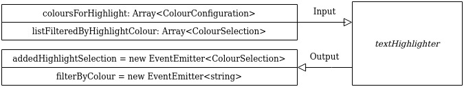

# TextHighlighter

This project was generated with [Angular CLI](https://github.com/angular/angular-cli) version 8.3.22.

## Setup

### Run `git clone https://github.com/tomaspl/textHighlighter` for download the project

### Go to textHighlighter folder : `cd textHighlighter`.

### Run `npm install` to install all the dependencies

## Development server

Run `ng serve` for a dev server. Navigate to `http://localhost:4200/`. The app will automatically reload if you change any of the source files.

## Running unit tests

Run `ng test` to execute the unit tests via [Karma](https://karma-runner.github.io).

# textHighlighter

The textHighlighter component has a textarea where the user can write. This component receives as input a group of colours. With those colours the user can highlight the text has written. It's not allowed to highlight text that had been previously highlighted. Also the user can filter in other box the text that has been highlighted with each one of the colours.

## Flow

### Highlight

As you can see in the diagram, the component receives as an input an arrangement with the configuration of the colors that will be, the name of the color and then its configuration in hexadecimal.

Then, once a color is selected and a portion of text is highlighted, the component issues the text that was highlighted and under which color it was made.

### Filter Highlight

The component emits the color that the user selects under which he wants to filter the highlighted texts under the same color.
Then, outside of the component, the logic of searching all the highlighted texts is made and applying the filter to pass the list of texts that are under the color selected as filter back to the component.
